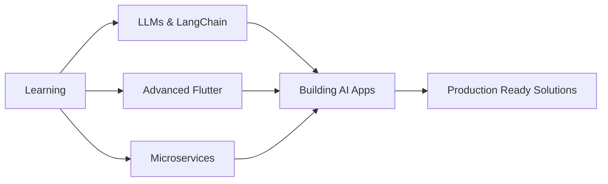

<div align="center">
  
# 👋 Hi, I'm Dwi Lutfi


[](https://www.linkedin.com/in/dwi-lutfi-988026277/)
[](https://personal-portofolio-pi-three.vercel.app/)
[](mailto:your.email@gmail.com)


</div>

---

## � About Me

```typescript
const dwi_lutfi = {
    location: "Surabaya, Indonesia 🇮🇩",
    education: "Information Systems @ Telkom University Surabaya",
    currentRole: "Mobile Developer Intern @ Dexs Pump",
    previousRole: "Mobile Developer Intern @ INDI Teknokreasi Internasional",
    
    expertise: {
        mobile: ["Flutter", "Kotlin", "Dart", "GetX", "Provider"],
        web: ["Next.js", "React", "TypeScript", "Tailwind CSS"],
        backend: ["Laravel", "FastAPI", "Node.js", "Docker"],
        ai_ml: ["TensorFlow", "PyTorch", "LangChain", "OpenAI API"],
        database: ["PostgreSQL", "MySQL", "MongoDB", "Firestore", "Supabase"],
        tools: ["Git", "Docker", "Figma", "Postman", "VS Code"]
    },
    
    currentlyLearning: ["LLMs", "LangChain", "Advanced AI", "Microservices"],
    interests: ["Clean Architecture", "UI/UX Design", "AI Integration", "Open Source"],
    
    funFact: "I turn coffee ☕ into code and Figma designs into pixel-perfect UIs ✨"
};
```

<details>
<summary>📊 More About My Coding Journey</summary>

- 🎯 **Focus Areas**: Building production-ready mobile apps, AI-powered solutions, and scalable web platforms
- 🏆 **Achievements**: Successfully delivered multiple full-stack projects with AI integration
- 🌱 **Growth Mindset**: Always exploring new technologies and best practices
- 💡 **Problem Solver**: Love tackling complex challenges with elegant solutions
- 🤝 **Team Player**: Experience collaborating in agile development environments

</details>

---

## �️ Tech Stack & Tools

### 💻 Languages


### 📱 Mobile Development


### 🌐 Web Development


### 🤖 AI & Machine Learning


### 🗄️ Databases & Backend


### 🛠️ DevOps & Tools


---

## � GitHub Analytics


<div align="center">
  


</div>

### 📈 Contribution Graph

<div align="center">
  
[](https://github.com/ashutosh00710/github-readme-activity-graph)

</div>

### 🏆 GitHub Trophies

<div align="center">
  


</div>

---

## � Featured Projects

<div align="center">

| 🚀 Project | 📝 Description | 🛠️ Tech Stack | 🔗 Links |
|-----------|---------------|---------------|----------|
| **🎯 SpeechDelay-AI** | AI-powered mobile app for early detection of speech delays in children using Denver II methodology | `Flutter` `Python` `TensorFlow` `ML` `Firebase` | [Demo](#) |
| **👥 GetCrew App** | Event crew finder platform with advanced review system, profile videos, and real-time matching | `Flutter` `Firebase` `GetX` `Firestore` `Cloud Functions` | [Demo](#) |
| **💍 Marielocation** | E-commerce platform for wedding gown browsing and purchasing with admin dashboard | `Laravel` `Bootstrap` `MySQL` `Blade` | [Demo](#) |
| **📝 Next Blog** | Modern blog platform with MDX support, smooth animations, and dark mode | `Next.js 14` `Tailwind` `Framer Motion` `MDX` | [Demo](#) |
| **🏥 DetectLiver-AI** | AI-based liver disease detection system using machine learning models | `Python` `Flask` `TensorFlow` `Google Colab` `HTML/CSS` | [WIP] |
| **📱 Super App** | All-in-one mobile application with microservices architecture | `Flutter` `Laravel` `GetX` `Docker` `PostgreSQL` | [WIP] |
| **🔮 New App** | Next-generation mobile app with AI integration and advanced features | `Flutter` `Laravel` `Python` `Docker` `AI/ML` | [WIP] |

</div>

<details>
<summary>🔍 View More Project Details</summary>

### 🎯 SpeechDelay-AI
- **Impact**: Helps parents detect speech delays early for timely intervention
- **Features**: AI-powered assessment, progress tracking, parent dashboard
- **Tech Highlights**: Custom ML model, offline-first architecture, beautiful UI

### 👥 GetCrew App
- **Impact**: Connects event organizers with qualified crew members
- **Features**: Video profiles, rating system, real-time chat, booking management
- **Tech Highlights**: Firebase real-time database, video streaming, push notifications

### 💍 Marielocation
- **Impact**: Simplifies wedding gown shopping experience
- **Features**: Product catalog, cart system, admin panel, order management
- **Tech Highlights**: MVC architecture, responsive design, secure payment integration

</details>

---

## 📈 Coding Activity

<div align="center">

<!--START_SECTION:waka-->
<!--END_SECTION:waka-->

</div>

---

## 🎯 Current Focus



- 🔭 Working on: **AI-powered mobile applications** and **scalable web platforms**
- 🌱 Learning: **Large Language Models**, **LangChain**, **Advanced AI Integration**
- 👯 Looking to collaborate on: **Open source projects**, **AI/ML applications**, **Flutter packages**
- 💬 Ask me about: **Flutter**, **Next.js**, **AI Integration**, **Clean Architecture**
- ⚡ Fun fact: I can debug code faster than I can debug my life 😄

---

## 📝 Latest Blog Posts

<!-- BLOG-POST-LIST:START -->
<!-- BLOG-POST-LIST:END -->

---

## 🤝 Let's Connect & Collaborate

<div align="center">

[](https://www.linkedin.com/in/dwi-lutfi-988026277/)
[](https://personal-portofolio-pi-three.vercel.app/)
[](mailto:your.email@gmail.com)
[](https://github.com/tetraxion)

</div>

<div align="center">

### 💡 Open for opportunities in:
**Mobile Development** • **Full Stack Development** • **AI/ML Engineering** • **Open Source Collaboration**

</div>

---

## 💭 Dev Quote

<div align="center">


</div>

---

**⭐ From [Dwi Lutfi](https://github.com/tetraxion) with 💙**

</div>
