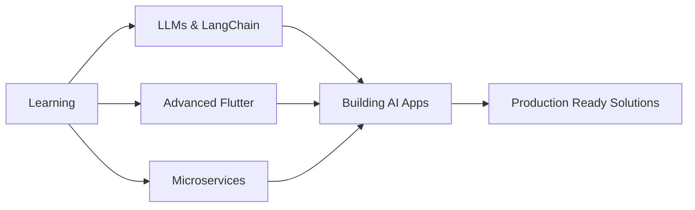

<div align="center">
  
# 👋 Hi, I'm Dwi Lutfi


[](https://www.linkedin.com/in/dwi-lutfi-988026277/)
[](https://personal-portofolio-pi-three.vercel.app/)
[](mailto:your.email@gmail.com)


</div>

---

## 👤 About Me

```typescript
const dwi_lutfi = {
    location: "Surabaya, Indonesia 🇮🇩",
    education: "Information Systems @ Telkom University Surabaya",
    currentRole: "Mobile Developer Intern @ Dexs Pump",
    previousRole: "Mobile Developer Intern @ INDI Teknokreasi Internasional",
    
    expertise: {
        mobile: ["Flutter", "Kotlin", "Dart", "GetX", "Provider"],
        web: ["Next.js", "React", "TypeScript", "Tailwind CSS"],
        backend: ["Laravel", "FastAPI", "Node.js", "Docker"],
        ai_ml: ["TensorFlow", "PyTorch", "LangChain", "OpenAI API"],
        database: ["PostgreSQL", "MySQL", "MongoDB", "Firestore", "Supabase"],
        tools: ["Git", "Docker", "Figma", "Postman", "VS Code"]
    },
    
    currentlyLearning: ["LLMs", "LangChain", "Advanced AI", "Microservices"],
    interests: ["Clean Architecture", "UI/UX Design", "AI Integration", "Open Source"],
    
    funFact: "I turn coffee ☕ into code and Figma designs into pixel-perfect UIs ✨"
};
```

<details>
<summary>📊 More About My Coding Journey</summary>

- 🎯 **Focus Areas**: Building production-ready mobile apps, AI-powered solutions, and scalable web platforms
- 🏆 **Achievements**: Successfully delivered multiple full-stack projects with AI integration
- 🌱 **Growth Mindset**: Always exploring new technologies and best practices
- 💡 **Problem Solver**: Love tackling complex challenges with elegant solutions
- 🤝 **Team Player**: Experience collaborating in agile development environments

</details>

---

## 🛠️ Tech Stack & Tools

### 💻 Languages


### 📱 Mobile Development


### 🌐 Web Development


### 🤖 AI & Machine Learning


### 🗄️ Databases & Backend


### 🛠️ DevOps & Tools


---

## 📊 GitHub Analytics


<div align="center">
  


</div>

### 📈 Contribution Graph

<div align="center">
  
[](https://github.com/ashutosh00710/github-readme-activity-graph)

</div>

### 🏆 GitHub Trophies

<div align="center">
  


</div>

---

## 🚀 Featured Projects

<div align="center">

| 🚀 Project | 📝 Description | 🛠️ Tech Stack | 🔗 Links |
|-----------|---------------|---------------|----------|
| **📦 VeloStock (Frontend)** | Web-based inventory tracking, activity audits, and RBAC system | `Vue 3` `Vite` `TypeScript` `Tailwind CSS` `PrimeVue` `Docker` | [GitHub](https://github.com/tetraxion/Front_Velostock) • [Demo](https://front-velostock-be83.vercel.app/) |
| **⚙️ VeloStock (Backend)** | Robust RESTful API with native routing, JWT authentication, and structured logging | `Go (Golang)` `PostgreSQL` `Docker` `Redis` | [GitHub](https://github.com/tetraxion/Back_Velostock) |
| **📊 ANARA** | Budget management information system for Deputy of Industry & Investment, Ministry of Tourism | `Laravel` `PHP` `MySQL` `Bootstrap` `Blade` | [Demo](https://anara.dbii.fun/login) |
| **🏠 Prime Property** | Property listing platform & secure agent portal with PostgreSQL Row Level Security (RLS) | `Next.js` `TypeScript` `Tailwind CSS` `Supabase` `PostgreSQL` | [GitHub](https://github.com/tetraxion/Prime_property.git) • [Demo](https://prime-property-chi.vercel.app/) |
| **🎨 Neo-Brutalism Portfolio** | High-contrast bold developer portfolio template with playful hover animations | `Next.js` `TypeScript` `Tailwind CSS` `Framer Motion` | [GitHub](https://github.com/tetraxion/Portofolio_theme_NeoBrutalism) • [Demo](https://portofolio-theme-neo-brutalism.vercel.app/) |
| **📝 Task Tracker API** | RESTful API featuring dual-storage (in-memory/PostgreSQL) and pgx connection pool | `Go (Golang)` `PostgreSQL` `Docker` | [GitHub](https://github.com/tetraxion/backend_test_dwi_lutfi.git) |
| **✨ Sparkling Kids** | Mobile learning hub for children talent and interest discovery | `Flutter` `Dart` `Laravel` `MySQL` `GetX` `Firebase` | [PlayStore](https://play.google.com/store/apps/details?id=com.solae.sparkling.id&hl=en-US) • [AppStore](https://apps.apple.com/au/app/sparkling-kids/id6756943374) |
| **🌊 FloodViser IoT** | Real-time flood telemetry monitoring and pump status control using MQTT protocol | `Flutter` `Dart` `MQTT` `Laravel` `MySQL` | [PlayStore](https://play.google.com/store/apps/details?id=com.floodviser.app&hl=en-US) • [AppStore](https://apps.apple.com/id/app/flood-viser/id6747161524) |
| **🏢 Sidoarjo SuperApp** | Citizen public services integration portal, complaint ticket submitter, and local MSME marketplace | `Flutter` `Dart` `Laravel` `PostgreSQL` `Docker` `GetX` | - |
| **🎬 CineExplore** | Responsive movie discovery app powered by TMDB API with watchlists and trailers | `Flutter` `Dart` `GetX` | [GitHub](https://github.com/tetraxion/tmdb) |
| **🛡️ CyberGuard Awareness Scanner** | Web security auditing and multi-threaded vulnerability scanner orchestrator | `Laravel` `PHP` `Python` `PostgreSQL` `Redis` `Docker` | - |
| **🩺 SpedyCheck** | Child development self-screening mobile tool with Supabase integration | `Flutter` `Dart` `Firebase` `Supabase` `GetX` | - |
| **👥 GetCrew** | Event crew hiring marketplace platform connecting organizers with MCs/photographers | `Flutter` `Dart` `Laravel` `MySQL` `GetX` | - |
| **👩‍⚕️ Bidan Delima** | Patient visit scheduling app for TPMB midwife clinic in Surabaya | `Flutter` `Dart` `Firebase` | [GitHub](https://github.com/tetraxion/bidan_delima) |
| **🚽 Disability Toilet Detect** | Object detection AI system trained on YOLOv8 for toilet grab bars accessibility | `Python` `Flask` `Roboflow` | [GitHub](https://github.com/dikawp/flask-roboflow) |
| **👗 Marie Location** | Wedding dress bridal gown catalog booking and inventory management platform | `Laravel` `Bootstrap` `MySQL` `Blade` | [GitHub](https://github.com/tetraxion/MarieLocation.git) |
| **📱 Flutter Web Portfolio** | Fully responsive developer profile built entirely with Flutter for Web | `Flutter` `Dart` | [GitHub](https://github.com/tetraxion/Web_Flutter_Portofolio) |
| **🚂 KAI Web Clone** | Booking system replica of the official Indonesian Railways website | `PHP` `MySQL` `HTML5/CSS3` `JavaScript` | [GitHub](https://github.com/tetraxion/KAI_PHP) |
| **🛍️ NuShoptara.co** | Showcase and e-commerce store promoting authentic Indonesian craft goods | `HTML5` `CSS3` `JavaScript` | [GitHub](https://github.com/tetraxion/Nushoptara_html) |

</div>

<details>
<summary>🔍 View More Project Details</summary>

### 📦 VeloStock (Frontend & Backend)
- **Impact**: Streamlines warehouse tracking and inventory operations for SMBs with full audit transparency.
- **Key Features**: Multi-role support (Admin & Warehouse Staff), stock alerts, activity audit log trails, and custom Nginx fallback configs.
- **Tech Highlights**: Go native http routing, pgx database pool, Vue composition API, Tailwind CSS, PrimeVue, and Docker Compose orchestration.

### 📊 ANARA
- **Impact**: Digitalized budget planning, standard SBM rate management, and SPJ reporting for a government agency department.
- **Key Features**: Dynamic calculation algorithms, auto-generated official PDF reports, spreadsheet imports, and administrative security management.
- **Tech Highlights**: Laravel framework, Blade templates, Alpine.js, DomPDF, and PhpSpreadsheet.

### 🏠 Prime Property
- **Impact**: Provides a scalable property portal for clients with an admin dashboard for internal agents.
- **Key Features**: Row Level Security (RLS), real-time listing status tracking, automatic audit logs via DB triggers, and interactive property profile view.
- **Tech Highlights**: Next.js App Router, Supabase Auth/DB, PostgreSQL, Tailwind CSS, and shadcn/ui.

### 🌊 Dexs Pump - FloodViser IoT
- **Impact**: Aids municipal field operators in monitoring critical water levels and controlling pumps to mitigate flooding risks.
- **Key Features**: Live sensor telemetry charts, remote pump state toggles, customizable alert thresholds, and Firebase push notifications.
- **Tech Highlights**: Flutter Riverpod state management, MQTT protocol client, and a Laravel backend engine.

### 🛡️ CyberGuard Awareness Scanner
- **Impact**: Enables web developers to run rapid audits of web security posture and obtain executive-ready vulnerability reports.
- **Key Features**: Passive fingerprinting, active fuzzing scripts (SQLi, SSRF, JWT checks), Redis queue runner, and interactive dashboards.
- **Tech Highlights**: Laravel job queue, multi-threaded Python scanner engine, Redis/Horizon, and DomPDF template exporter.

</details>

---

## 📈 Coding Activity

<div align="center">

<!--START_SECTION:waka-->
<!--END_SECTION:waka-->

</div>

---

## 🎯 Current Focus



- 🔭 Working on: **AI-powered mobile applications** and **scalable web platforms**
- 🌱 Learning: **Large Language Models**, **LangChain**, **Advanced AI Integration**
- 👯 Looking to collaborate on: **Open source projects**, **AI/ML applications**, **Flutter packages**
- 💬 Ask me about: **Flutter**, **Next.js**, **AI Integration**, **Clean Architecture**
- ⚡ Fun fact: I can debug code faster than I can debug my life 😄

---

## 📝 Latest Blog Posts

<!-- BLOG-POST-LIST:START -->
<!-- BLOG-POST-LIST:END -->

---

## 🤝 Let's Connect & Collaborate

<div align="center">

[](https://www.linkedin.com/in/dwi-lutfi-988026277/)
[](https://personal-portofolio-pi-three.vercel.app/)
[](mailto:your.email@gmail.com)
[](https://github.com/tetraxion)

</div>

<div align="center">

### 💡 Open for opportunities in:
**Mobile Development** • **Full Stack Development** • **AI/ML Engineering** • **Open Source Collaboration**

</div>

---

## 💭 Dev Quote

<div align="center">


</div>

---

**⭐ From [Dwi Lutfi](https://github.com/tetraxion) with 💙**

</div>
