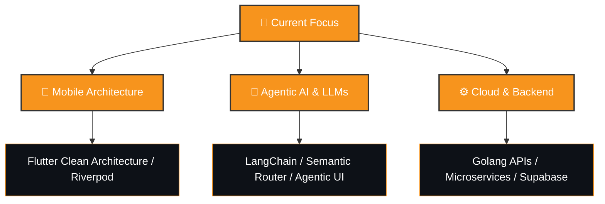

<div align="center">


<br/>


<br/>

[](https://www.linkedin.com/in/dwi-lutfi-988026277/)
[](https://personal-portofolio-pi-three.vercel.app/)
[](mailto:lutfid955@gmail.com)


</div>

---

## 👤 About Me

```typescript
const dwi_lutfi = {
    location: "Surabaya, Indonesia 🇮🇩",
    education: "Information Systems @ Telkom University Surabaya",
    currentRole: "Mobile Developer Intern @ Dexs Pump",
    previousRole: "Mobile Developer Intern @ INDI Teknokreasi Internasional",
    
    expertise: {
        mobile: ["Flutter", "Kotlin", "Dart", "GetX", "Provider"],
        web: ["Next.js", "React", "TypeScript", "Tailwind CSS"],
        backend: ["Laravel", "FastAPI", "Node.js", "Docker"],
        ai_ml: ["TensorFlow", "PyTorch", "LangChain", "OpenAI API"],
        database: ["PostgreSQL", "MySQL", "MongoDB", "Firestore", "Supabase"],
        tools: ["Git", "Docker", "Figma", "Postman", "VS Code"]
    },
    
    currentlyLearning: ["LLMs", "LangChain", "Advanced AI", "Microservices"],
    interests: ["Clean Architecture", "UI/UX Design", "AI Integration", "Open Source"],
    
    funFact: "I turn coffee ☕ into code and Figma designs into pixel-perfect UIs ✨"
};
```

<details>
<summary>📊 <b>More About My Coding Journey</b></summary>

- 🎯 **Focus Areas**: Building production-ready mobile apps, AI-powered solutions, and scalable web platforms
- 🏆 **Achievements**: Successfully delivered multiple full-stack projects with AI integration
- 🌱 **Growth Mindset**: Always exploring new technologies and best practices
- 💡 **Problem Solver**: Love tackling complex challenges with elegant solutions
- 🤝 **Team Player**: Experience collaborating in agile development environments

</details>

---

## 🛠️ Tech Stack & Tools

<table border="0" width="100%">
  <tr>
    <td valign="top" width="50%">
      <h3>📱 Mobile Development</h3>
      <a href="https://flutter.dev"></a>
      <a href="https://kotlinlang.org"></a>
      <a href="https://dart.dev"></a>
      <a href="https://developer.android.com"></a>
      <a href="https://firebase.google.com"></a>
    </td>
    <td valign="top" width="50%">
      <h3>🌐 Web & Backend</h3>
      <a href="https://nextjs.org"></a>
      <a href="https://react.dev"></a>
      <a href="https://laravel.com"></a>
      <a href="https://fastapi.tiangolo.com"></a>
      <a href="https://typescriptlang.org"></a>
      <a href="https://tailwindcss.com"></a>
    </td>
  </tr>
  <tr>
    <td valign="top" width="50%">
      <h3>🤖 AI & Machine Learning</h3>
      <a href="https://tensorflow.org"></a>
      <a href="https://pytorch.org"></a>
      <a href="https://openai.com"></a>
      <a href="https://langchain.com"></a>
    </td>
    <td valign="top" width="50%">
      <h3>🛠️ Databases & DevOps</h3>
      <a href="https://postgresql.org"></a>
      <a href="https://supabase.com"></a>
      <a href="https://docker.com"></a>
      <a href="https://git-scm.com"></a>
      <a href="https://figma.com"></a>
    </td>
  </tr>
</table>

---

## 🚀 Featured Projects

### 📦 VeloStock — Smart Inventory System
> **An enterprise-grade stock tracking and warehouse operations platform with role-based access control (RBAC) and real-time audit logs.**
>
> 🛠️ **Tech Stack:** `Go (Golang)` `Vue 3` `TypeScript` `PostgreSQL (pgx)` `Docker` `Redis`
>
> 🌐 **Links:** [Frontend Repo](https://github.com/tetraxion/Front_Velostock) | [Backend Repo](https://github.com/tetraxion/Back_Velostock) | [Live Demo](https://front-velostock-be83.vercel.app/)
>
> - Designed a high-performance backend using Go's native HTTP routing and pgx connection pooling.
> - Implemented real-time activity audit trails and automatic low-stock notifications.
> - Configured Nginx reverse-proxy setup with fallback routines for seamless SPA deployment.

### 🌊 FloodViser IoT — Flood Monitoring & Control
> **A real-time flood telemetry monitoring and pump status control application built for municipal field operators.**
>
> 🛠️ **Tech Stack:** `Flutter` `Dart` `MQTT` `Laravel` `MySQL`
>
> 🌐 **Links:** [Google Play Store](https://play.google.com/store/apps/details?id=com.floodviser.app&hl=en-US) | [Apple App Store](https://apps.apple.com/id/app/flood-viser/id6747161524)
>
> - Integrated the MQTT protocol to deliver instant, sub-second telemetry and remote pump state toggling.
> - Managed production releases and successfully published the application on both App Stores.

### 📊 ANARA — Government Budget Information System
> **A digitalized budget planning, SBM rate management, and SPJ reporting system for a department within the Indonesian Ministry of Tourism.**
>
> 🛠️ **Tech Stack:** `Laravel (PHP)` `MySQL` `Alpine.js` `DomPDF` `PhpSpreadsheet`
>
> 🌐 **Links:** [Live Demo](https://anara.dbii.fun/login)
>
> - Engineered dynamic calculation algorithms to automate official government budget allocations and reports.
> - Implemented secure spreadsheet import reconciliations and PDF export flows.

### 🏠 Prime Property — Real Estate Listing Portal
> **A property listings directory and real estate agent management portal with robust data isolation patterns.**
>
> 🛠️ **Tech Stack:** `Next.js` `TypeScript` `Tailwind CSS` `Supabase` `PostgreSQL (RLS)`
>
> 🌐 **Links:** [GitHub Repo](https://github.com/tetraxion/Prime_property.git) | [Live Demo](https://prime-property-chi.vercel.app/)
>
> - Utilized Supabase RLS policies to build secure workspace divisions between separate listing agents.
> - Engineered database-level triggers to write automated immutable audit logs for edit/delete actions.

### 🛡️ CyberGuard Awareness Scanner — Vulnerability Auditor
> **A web security auditing orchestrator and multi-threaded script runner designed for rapid developer posture audits.**
>
> 🛠️ **Tech Stack:** `Laravel` `Python` `PostgreSQL` `Redis` `Docker`
>
> - Designed a backend job queue to distribute scanner workloads across passive fingerprinters and active fuzzers.
> - Developed custom Python auditing scripts for detecting common vulnerabilities (SQLi, SSRF, JWT checks).

<details>
<summary><b>🔍 View More Projects (Mobile, Web, & AI)</b></summary>
<br/>

### 📱 Mobile Applications

| Project | Stack | Description | Links |
| :--- | :--- | :--- | :--- |
| **✨ Sparkling Kids** | Flutter, GetX, Firebase, Laravel | Mobile hub for child interest and talent discovery | [Play Store](https://play.google.com/store/apps/details?id=com.solae.sparkling.id&hl=en-US) • [App Store](https://apps.apple.com/au/app/sparkling-kids/id6756943374) |
| **🏢 Sidoarjo SuperApp** | Flutter, GetX, Laravel, PostgreSQL | City public services, complaints tracker & MSME marketplace | — |
| **🩺 SpedyCheck** | Flutter, Supabase, Firebase, GetX | Child development self-screening tool | — |
| **👥 GetCrew** | Flutter, GetX, Laravel, MySQL | Event crew hiring marketplace | — |
| **👩‍⚕️ Bidan Delima** | Flutter, Firebase | Patient scheduling tool for TPMB Midwife Clinic | [GitHub](https://github.com/tetraxion/bidan_delima) |
| **🎬 CineExplore** | Flutter, GetX, TMDB API | Responsive TMDB-powered movie discovery client | [GitHub](https://github.com/tetraxion/tmdb) |
| **📱 Flutter Web Portfolio** | Flutter, Dart | Developer profile portfolio built entirely on Flutter Web | [GitHub](https://github.com/tetraxion/Web_Flutter_Portofolio) |

### 🌐 Web & Backend Applications

| Project | Stack | Description | Links |
| :--- | :--- | :--- | :--- |
| **🎨 Neo-Brutalism Portfolio** | Next.js, Framer Motion, Tailwind | Responsive developer portfolio with bold styling | [GitHub](https://github.com/tetraxion/Portofolio_theme_NeoBrutalism) • [Demo](https://portofolio-theme-neo-brutalism.vercel.app/) |
| **📝 Task Tracker API** | Go, PostgreSQL, Docker | RESTful API with PostgreSQL pgx connection pool | [GitHub](https://github.com/tetraxion/backend_test_dwi_lutfi.git) |
| **👗 Marie Location** | Laravel, Bootstrap, MySQL | Wedding dress bridal catalog and inventory manager | [GitHub](https://github.com/tetraxion/MarieLocation.git) |
| **🚂 KAI Web Clone** | PHP, MySQL, CSS | Replica booking client for Indonesian Railways | [GitHub](https://github.com/tetraxion/KAI_PHP) |
| **🛍️ NuShoptara.co** | HTML, CSS, JavaScript | E-commerce showcase for authentic Indonesian crafts | [GitHub](https://github.com/tetraxion/Nushoptara_html) |

### 🤖 IoT & Machine Learning

| Project | Stack | Description | Links |
| :--- | :--- | :--- | :--- |
| **🚽 Disability Toilet Detect** | Python, Flask, YOLOv8, Roboflow | Object detection AI for toilet grab bar accessibility | [GitHub](https://github.com/dikawp/flask-roboflow) |

</details>

---

## 🎯 Current Focus & Roadmap



- 🔭 Working on: **AI-powered mobile applications** and **scalable web platforms**
- 🌱 Learning: **Large Language Models**, **LangChain**, **Advanced AI Integration**
- 👯 Looking to collaborate on: **Open source projects**, **AI/ML applications**, **Flutter packages**
- 💬 Ask me about: **Flutter**, **Next.js**, **AI Integration**, **Clean Architecture**
- ⚡ Fun fact: I can debug code faster than I can debug my life 😄

---

## 📊 GitHub Analytics

<div align="center">
  <table border="0">
    <tr>
      <td>
        
      </td>
      <td>
        
      </td>
    </tr>
  </table>
  <br/>
  
</div>

### 📈 Contribution Graph

<div align="center">
  
[](https://github.com/ashutosh00710/github-readme-activity-graph)

</div>

### 🏆 GitHub Trophies

<div align="center">
  


</div>

---

## 📈 Coding Activity

<div align="center">

<!--START_SECTION:waka-->
<!--END_SECTION:waka-->

</div>

---

## 📝 Latest Blog Posts

<!-- BLOG-POST-LIST:START -->
<!-- BLOG-POST-LIST:END -->

---

## 🤝 Let's Connect & Collaborate

<div align="center">

[](https://www.linkedin.com/in/dwi-lutfi-988026277/)
[](https://personal-portofolio-pi-three.vercel.app/)
[](mailto:lutfid955@gmail.com)
[](https://github.com/tetraxion)

</div>

<div align="center">

### 💡 Open for opportunities in:
**Mobile Development** • **Full Stack Development** • **AI/ML Engineering** • **Open Source Collaboration**

</div>

---

## 💭 Dev Quote

<div align="center">


</div>

---

<div align="center">

**⭐ From [Dwi Lutfi](https://github.com/tetraxion) with 💙**

</div>
